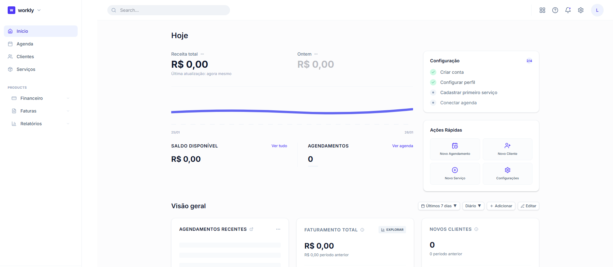

# 💼 Workly - Gerencie seu negócio com inteligência

> Plataforma open-source para profissionais de serviços organizarem agenda, clientes e pagamentos em minutos.

O Workly foi desenhado para ser simples, rápido e focado no que realmente importa: o crescimento do seu negócio. Centralize agenda, clientes e pagamentos em uma única plataforma, eliminando o trabalho manual e profissionalizando o atendimento.



## ❓ Por que o Workly existe?

A maioria dos profissionais hoje ainda depende de uma mistura caótica de mensagens no WhatsApp, planilhas manuais e a própria memória para gerir seus clientes. 

O Workly surge para profissionalizar essa gestão, automatizando cobranças e organizando o fluxo de trabalho desde o primeiro contato até o pagamento final.

## 🎯 Para quem é

- ✂️ **Barbeiros e Cabeleireiros**
- 💅 **Manicures e Esteticistas**
- 💉 **Tatuadores**
- 🏋️ **Personal Trainers**
- 💻 **Freelancers**
- 🛠️ **Pequenos Prestadores de Serviço**

## 🚀 Funcionalidades

- **Dashboard Inteligente**: Visão clara do seu negócio e faturamento em tempo real.
- **Gestão de Assinaturas**: Sistema de planos (Solo, Business) integrado com Stripe.
- **Página de Link Profissional**: Perfil público dinâmico para agendamentos (`/b/[slug]`) com suporte a banner, logo e links personalizados.
- **Gestão de Clientes (CRM)**: Histórico completo, dados de contato e notas sobre cada cliente.
- **Gestão de Serviços**: Controle total sobre catálogo de serviços, incluindo preços, duração e descrições.
- **Agenda Interativa**: Visualização de agendamentos, status (pendente, confirmado, finalizado) e organização diária.
- **Autenticação Segura**: Fluxo robusto utilizando Better Auth.
- **Design Premium**: Interface moderna, pensada na experiência do usuário e 100% responsiva.

## 🛠️ Stack

- **Framework**: [Next.js 16+](https://nextjs.org/) (App Router)
- **Pagamentos**: [Stripe](https://stripe.com/) (Checkout & Portais)
- **Estilização**: [Tailwind CSS v4](https://tailwindcss.com/)
- **Autenticação**: [Better Auth](https://www.better-auth.com/)
- **ORM**: [Drizzle ORM](https://orm.drizzle.team/)
- **Banco de Dados**: [Neon (PostgreSQL)](https://neon.tech/)
- **Uploads**: [UploadThing](https://uploadthing.com/)
- **Ícones**: [Lucide React](https://lucide.dev/)
- **Animações**: [GSAP](https://gsap.com/)
- **Linguagem**: [TypeScript](https://www.typescriptlang.org/)

## 📂 Estrutura do Projeto

```
/
├── app/                # Rotas e Páginas (App Router)
│   ├── (auth)/         # Rotas de Autenticação
│   ├── dashboard/      # Painel Administrativo (Protegido)
│   ├── api/            # API Routes & Webhooks
│   └── layout.tsx      # Layout Principal
├── components/         # Componentes Reutilizáveis
│   ├── ui/             # Componentes de UI Base (Buttons, Inputs, etc)
│   └── sections/       # Seções da Landing Page
├── lib/                # Funções Utilitárias e Configurações
│   ├── schema.ts       # Schema do Banco de Dados (Drizzle)
│   ├── stripe.ts       # Configuração do Stripe
│   └── auth.ts         # Configuração do Better Auth
├── public/             # Arquivos Estáticos
└── drizzle/            # Migrações do Banco de Dados
```

## 🗺️ Roadmap

### Já Implementado ✅
- [x] **Autenticação Completa**: Login, Registro e Proteção de rotas com Better Auth.
- [x] **Gestão de Clientes (CRM)**: Cadastro e organização de clientes.
- [x] **Gestão de Serviços (CRUD)**: Criação e controle de catálogo de serviços.
- [x] **Pagamentos & Assinaturas**: Integração total com Stripe (Checkout, Webhooks e Portal de faturamento).
- [x] **Página de Link Profissional**: Sistema de perfil público dinâmico.
- [x] **Gestão de Imagens**: Upload de logo e banner via UploadThing.
- [x] **Dashboard Administrativo**: Visão geral e estatísticas básicas.

### Em Desenvolvimento / Futuro 🚀
- [ ] **Sistema de Agendamentos**: Calendário interativo para clientes (em andamento).
- [ ] **Lembretes Automáticos**: Notificações via WhatsApp e E-mail.
- [ ] **Relatórios Financeiros Avançados**: Gráficos de lucro e performance de serviços.
- [ ] **App Mobile (PWA)**: Atalho para acesso rápido.
- [ ] **Multi-profissionais**: Suporte para equipes e salões.

## 🏁 Começando

### Pré-requisitos

- Node.js (versão 18 ou superior)
- NPM, Yarn, PNPM ou Bun
- Contas no Neon.tech (DB), Stripe (Pagamentos) e UploadThing (Imagens).

### Configuração das Variáveis de Ambiente

Crie um arquivo `.env` na raiz do projeto:

```env
# Banco de Dados
DATABASE_URL=seu_link_do_neon_db

# Autenticação (Better Auth)
BETTER_AUTH_SECRET=sua_chave_secreta
BETTER_AUTH_URL=http://localhost:3000

# Arquivos (UploadThing)
UPLOADTHING_TOKEN=seu_token

# Pagamentos (Stripe)
STRIPE_SECRET_KEY=sk_test_...
NEXT_PUBLIC_STRIPE_PUBLISHABLE_KEY=pk_test_...
STRIPE_WEBHOOK_SECRET=whsec_...
STRIPE_SOLO_PRICE_ID=price_...
STRIPE_BUSINESS_PRICE_ID=price_...

# App
NEXT_PUBLIC_APP_URL=http://localhost:3000
```

### Instalação

1. **Clone e Instale:**
```bash
npm install
```

2. **Prepare o banco de dados:**
```bash
# Gere os arquivos de migração
npx drizzle-kit generate

# Envie as alterações para o banco
npx drizzle-kit migrate
# ou para prototipagem rápida:
npx drizzle-kit push
```

3. **Inicie o servidor:**
```bash
npm run dev
```

### Scripts Disponíveis

- `npm run dev`: Inicia o servidor de desenvolvimento.
- `npm run build`: Cria a build de produção.
- `npm run start`: Inicia o servidor de produção.
- `npm run lint`: Verifica erros de linting.


## 📄 Licença

Este projeto está sob a licença MIT. Veja o arquivo [LICENSE](LICENSE) para mais detalhes.

---

Desenvolvido por **Leonardo Bozola**.
